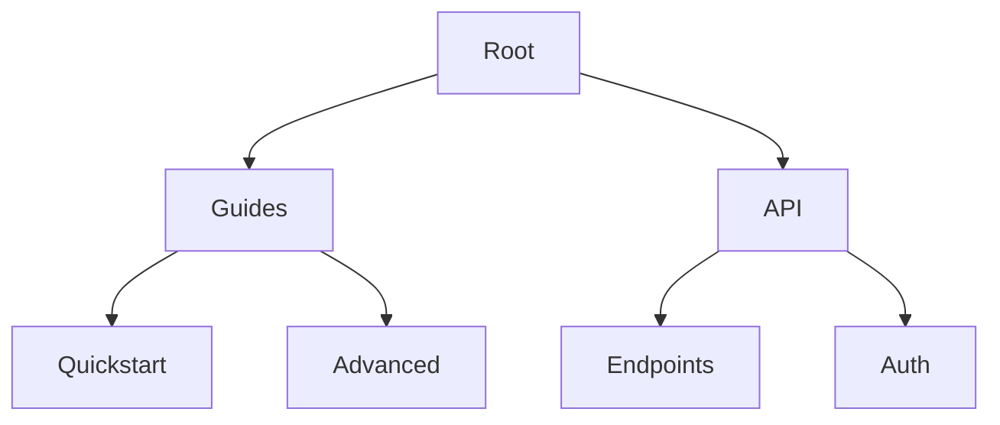

## Overview

Test provides powerful features to streamline your documentation workflow. You organize content hierarchically, collaborate seamlessly with teams, track changes over time, and control access precisely. These tools ensure your project documentation stays current and accessible.

<Columns cols={2}>
  <Card title="Organize Documents" icon="folder" href="#organization">
    Structure your docs with folders and pages for easy navigation.
  </Card>
  <Card title="Collaborate Effectively" icon="users" href="#collaboration">
    Real-time editing and comments keep teams aligned.
  </Card>
  <Card title="Track Versions" icon="git-branch" href="#versions">
    Full history lets you revert changes instantly.
  </Card>
  <Card title="Search and Access" icon="search" href="#access">
    Powerful search with granular permissions.
  </Card>
</Columns>

## Document Organization and Structuring

Create a clear hierarchy using folders and subpages. You nest content intuitively, mirroring your project's structure. Use the sidebar to drag and drop pages for reorganization.

<Steps>
  <Step title="Create Folders" icon="folder-plus">
    Click the `+` icon in the sidebar and select `New Folder`. Name it descriptively, like `API Reference`.
  </Step>
  <Step title="Add Pages" icon="file-plus">
    Right-click a folder and choose `New Page`. Use MDX for rich content with components.
  </Step>
  <Step title="Reorder Content" icon="move">
    Drag pages within folders to set the order. Changes save automatically.
  </Step>
</Steps>



<Callout kind="tip">
  Prefix page titles with numbers like `01-Introduction` for automatic sorting.
</Callout>

## Collaboration and Editing Tools

Invite team members for real-time collaboration. You edit simultaneously, add comments, and resolve suggestions without version conflicts.

<Tabs>
  <Tab title="Invite Collaborators" icon="user-plus">
    Go to `Settings > Team` and enter emails. Assign roles: `Editor`, `Viewer`, or `Admin`.
  </Tab>
  <Tab title="Inline Comments" icon="message-circle">
    Highlight text and click `Comment`. `@mention` users for notifications.
  </Tab>
</Tabs>

<CodeGroup tabs="API,CLI">
  ```javascript
  // Invite via API
  const response = await fetch('https://api.example.com/v1/teams/invite', {
    method: 'POST',
    headers: { Authorization: `Bearer ${YOUR_API_KEY}` },
    body: JSON.stringify({
      email: 'user@example.com',
      role: 'editor'
    })
  });
  ```
  ```bash
  # Invite via CLI
  test-cli teams invite user@example.com --role editor --api-key YOUR_API_KEY
  ```
</CodeGroup>

## Version History and Changes Tracking

Every edit creates a snapshot. You view diffs, restore previous versions, and track who made changes.

<Expandable title="View History" default-open="true">
  Open a page, click `History` in the top bar. Select a version to compare or restore.

  | Action       | Shortcut     |
  |--------------|--------------|
  | View Diff    | `H`          |
  | Restore      | `R`          |
  | Download     | `D`          |
</Expandable>

<Callout kind="info">
  History retains unlimited versions for paid plans; free plans keep 30 days.
</Callout>

## Search and Access Controls

Full-text search indexes all content instantly. Set permissions at folder or page level for precise control.

<ParamField path="teamId" param-type="string" required="true">
  Unique team identifier for access scoping.
</ParamField>

<ParamField header="X-Permissions" param-type="array" required="false">
  Comma-separated roles: `read,write,admin`.
</ParamField>

<Tabs>
  <Tab title="Global Search" icon="search">
    Press `Cmd/Ctrl + K` to search across all docs.
  </Tab>
  <Tab title="Scoped Permissions" icon="shield">
    In folder settings, toggle `Public` or restrict to specific teams.
  </Tab>
</Tabs>

These features empower you to maintain professional documentation effortlessly. Start by organizing your first folder today.