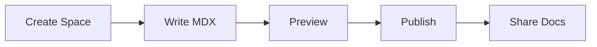

## Overview

Test provides a centralized space for your project documentation. You can create, organize, and publish docs effortlessly using MDX. This platform supports version control, search, and custom themes to streamline your workflow.

## Key Features

Test offers powerful tools to manage your documentation effectively.

<Columns cols={3}>
  <Card title="MDX Support" icon="code" href="#mdx-section">
    Write rich docs with MDX components, code blocks, and interactive elements.
  </Card>
  <Card title="Version Control" icon="git-branch" href="#version-section">
    Track changes, collaborate, and roll back with integrated Git support.
  </Card>
  <Card title="Custom Navigation" icon="menu" href="#nav-section">
    Build intuitive sidebars and search for seamless user experience.
  </Card>
</Columns>

## Quick Start

Get started with Test in minutes.

<Steps>
  <Step title="Create a Space" icon="plus">
    Sign up at `https://dashboard.example.com` and create your first documentation space.
  </Step>
  <Step title="Add Your First Doc" icon="file-text">
    Upload or write your `introduction.mdx` file using the editor.
  </Step>
  <Step title="Publish" icon="rocket">
    Preview changes and deploy your site live.
  </Step>
</Steps>

<CodeGroup tabs="CLI,API">
  ```bash
  npm install -g test-cli
  test init my-docs
  test deploy
  ```
  ```javascript
  const test = require('test-sdk');
  await test.createSpace({ name: 'my-project' });
  await test.publish({ spaceId: 'space-123' });
  ```
</CodeGroup>

## Quick Navigation Guide

Access core sections quickly based on your needs.

<Tabs>
  <Tab title="Beginners" icon="user">
    Start with [Quickstart](/quickstart) for setup basics.
  </Tab>
  <Tab title="Developers" icon="code">
    Explore [Authentication](/authentication) for API integrations.
  </Tab>
  <Tab title="Admins" icon="settings">
    Check [Configuration](/configuration) for advanced options.
  </Tab>
</Tabs>

## Why Choose Test

<Callout kind="tip">
  Test stands out with unlimited spaces, native MDX rendering, and zero-config deployments. You save time on setup and focus on content creation. Unlike static generators, Test handles hosting, search, and analytics automatically.
</Callout>

## Next Steps

Dive deeper into Test.

<Columns cols={2}>
  <Card title="Quickstart Guide" icon="book-open" href="/quickstart">
    Set up your first project.
  </Card>
  <Card title="Authentication" icon="lock" href="/authentication">
    Secure your API access.
  </Card>
  <Card title="Changelog" icon="git-commit" href="/changelog">
    See recent updates.
  </Card>
  <Card title="Help Center" icon="help-circle" href="/help-center">
    Find answers fast.
  </Card>
</Columns>



Test empowers you to build professional documentation sites without complexity. Explore the features above and start documenting today.